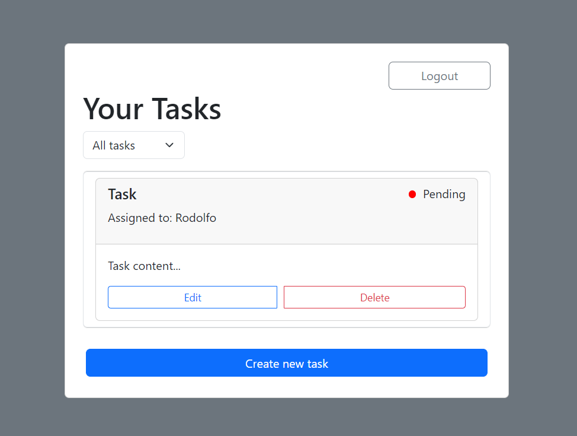

# task-manager-system-trabalho

This project aims to develop a web application using Python that simulates the basic functionalities of a task management system, similar to Trello. The application allows users to manage their tasks, including features such as creating, editing, deleting, and assigning tasks to users.

# Installation

(Windows)
- Create and activate an environment with `python -m venv venv` then `venv\Scripts\activate`.

- Install all requirements listed in `requirements.txt` file using `pip install -r requirements.txt`.

- Create database using `py create_db.py`.

- Run application with `flask run` or `flask run --debug`.

# About

This project is a task management web application built with Flask and Bootstrap. The main page displays a task list where users can view the title, status (with color indicators), content, and the person responsible for each task. A filter feature allows users to sort tasks by status (pending, in progress, or completed). Additionally, users can create, edit, or delete tasks directly from the interface. The interface is responsive and designed for simplicity, making navigation and task management easy, with a logout button conveniently located at the top of the page.

